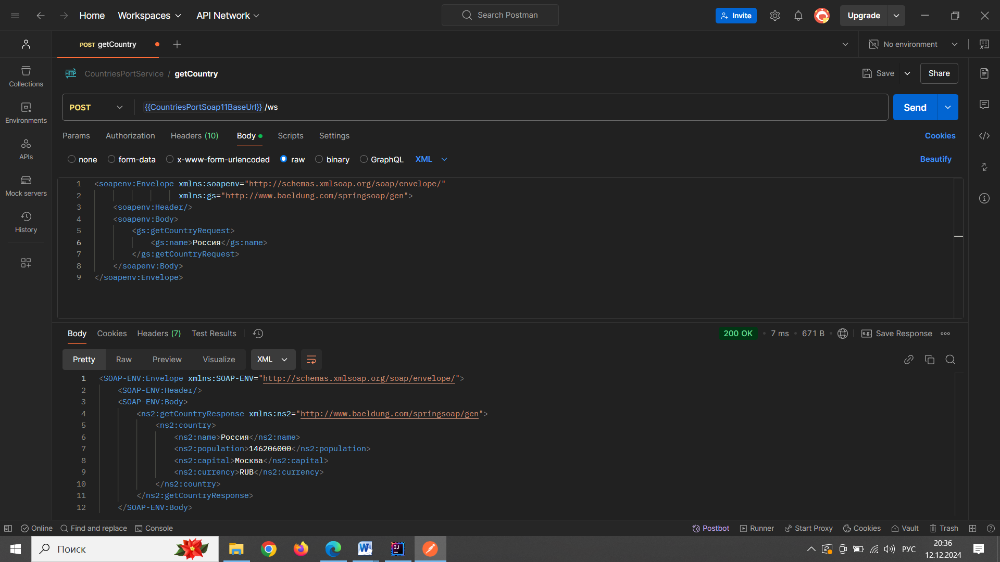

# Основа для SOAP заглушки
Путь для получения wsdl: http://localhost:8080/ws/countries.wsdl  
Путь для отправления запросов: http://localhost:8080/ws

Пример тела запроса:  
```xml
<soapenv:Envelope xmlns:soapenv="http://schemas.xmlsoap.org/soap/envelope/"
                  xmlns:gs="http://www.baeldung.com/springsoap/gen">
    <soapenv:Header/>
    <soapenv:Body>
        <gs:getCountryRequest>
            <gs:name>Россия</gs:name>
        </gs:getCountryRequest>
    </soapenv:Body>
</soapenv:Envelope>
```
Пример тела ответа:  
```xml
<SOAP-ENV:Envelope xmlns:SOAP-ENV="http://schemas.xmlsoap.org/soap/envelope/">
    <SOAP-ENV:Header/>
    <SOAP-ENV:Body>
        <ns2:getCountryResponse xmlns:ns2="http://www.baeldung.com/springsoap/gen">
            <ns2:country>
                <ns2:name>Россия</ns2:name>
                <ns2:population>146206000</ns2:population>
                <ns2:capital>Москва</ns2:capital>
                <ns2:currency>RUB</ns2:currency>
            </ns2:country>
        </ns2:getCountryResponse>
    </SOAP-ENV:Body>
</SOAP-ENV:Envelope>
```
Пример тела запроса и ответа из Postman:

